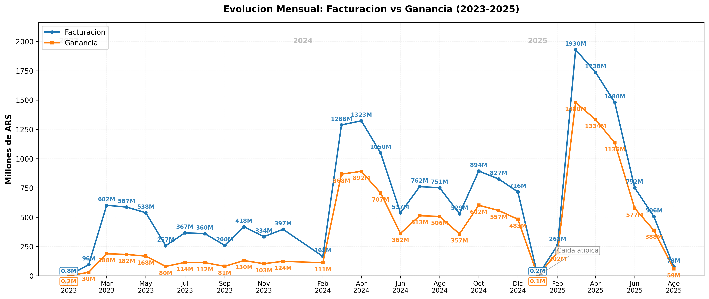
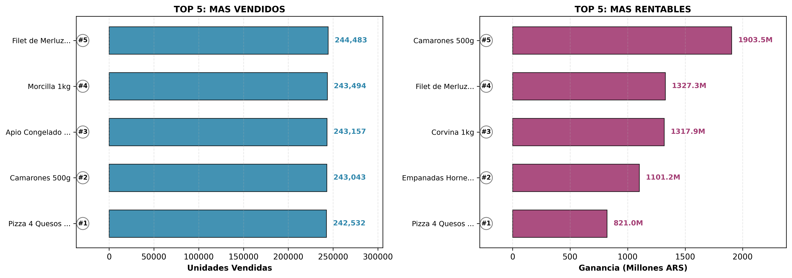

# Proyecto SQL Server + Python  
## Analisis de una Distribuidora Mayorista de Alimentos (2023-2025)



Proyecto de analisis de datos orientado a una distribuidora mayorista simulada, utilizando **SQL Server** para modelado relacional y consultas analiticas, y **Python (Matplotlib)** para visualizacion de insights clave.

**Skills demostradas:** modelado relacional · consultas SQL analiticas (JOIN, CTE, window functions) · agregaciones y segmentacion · optimizacion con indices · exportacion de resultados · visualizacion con Python · documentacion de hallazgos de negocio.

> Analisis completo con tablas, hallazgos y recomendaciones: [`docs/RESULTADOS_Y_ANALISIS.md`](docs/RESULTADOS_Y_ANALISIS.md)

---

## Objetivo

Analizar el desempeno comercial de una distribuidora mayorista, evaluando ventas, rentabilidad, comportamiento de clientes y evolucion temporal del negocio.

El proyecto se centra en la correcta formulacion de preguntas de negocio, el uso eficiente de SQL para el analisis de datos y la representacion visual de los principales hallazgos.

---

## Tecnologias utilizadas

- SQL Server
- Python (Pandas, Matplotlib, NumPy)
- Git & GitHub

---

## Estructura del repositorio

```
├── sql/
│   ├── 01_Creacion_BD_y_Tablas.sql
│   ├── 02_Carga_Masiva_Datos.sql
│   ├── 03_Consultas_Basicas.sql
│   ├── 04_Consultas_Avanzadas.sql
│   └── 05_Indices_y_Performance.sql
│
├── data/
│   ├── a1.*.csv … a6.*.csv    # Resultados consultas avanzadas
│   └── b1.*.csv … b7.*.csv    # Resultados consultas basicas
│
├── python/
│   ├── generar_todos_graficos.py
│   ├── grafico_evolucion_mensual.py
│   ├── grafico_top10_clientes.py
│   ├── productos_vendidos_vs_rentables.py
│   ├── grafico_rentabilidad_tipo_comercio.py
│   ├── grafico_ticket_promedio_anual.py
│   ├── grafico_estacionalidad.py
│   └── requirements.txt
│
├── img/
│   ├── graficos/              # Graficos generados con Matplotlib
│   ├── 2.cargadatos/          # Capturas de carga y validacion
│   └── 4.indices/             # Planes de ejecucion e IO (con/sin indice)
│
├── docs/
│   ├── Simulacion_y_Analisis_Distribuidora_Mayorista.docx
│   └── RESULTADOS_Y_ANALISIS.md
│
└── README.md
```

---

## Analisis realizados

### Analisis basicos (`03_Consultas_Basicas.sql`)

| Consulta | Archivo CSV |
|----------|-------------|
| Unidades promedio por venta | `b1.unidades_totales_por_venta.csv` |
| Estado de ventas por ano | `b2.estado_ventas_por_anio.csv` |
| Metodo de pago mas usado | `b3.metodo_pago_mas_usado_anual.csv` |
| Clientes segun antiguedad | `b4.cantidad_clientes_segun_antiguedad.csv` |
| Ticket promedio por ano | `b5.ticket_promedio_por_anio.csv` |
| Ventas por estacion | `b6.ventas_segun_estacion_anio.csv` |
| Dias con mayor volumen | `b7.dias_mes_mayor_volumen_ventas.csv` |

### Analisis avanzados (`04_Consultas_Avanzadas.sql`)

| Consulta | Archivo CSV |
|----------|-------------|
| Evolucion mensual ventas y ganancias | `a1.evolucion_mensual_ventas_ganancias.csv` |
| Top 10 clientes por facturacion | `a2.ranking_clientes_que_mas_facturan_ganancias_asociadas.csv` |
| Rentabilidad por tipo de comercio | `a3.rentabilidad_promedio_tipo_comercio.csv` |
| Productos mas vendidos vs rentables | `a4.productos_mas_vendidos_vs_mas_rentables.csv` |
| Ventas mensuales por categoria | `a5.ventas_mensuales_por_categoria_producto.csv` |
| Segmentacion por frecuencia de compra | `a6.clasificar_clientes_segun_frecuencia_compra.csv` |

### Optimizacion (`05_Indices_y_Performance.sql`)

Prueba comparativa de una consulta de evolucion mensual **antes y despues** de crear un indice en `Detalle_Ventas(ID_Venta)`. Capturas en `img/4.indices/`.

---

## Graficos destacados

Los dos insights mas relevantes del analisis:

**Evolucion mensual** — tendencia de crecimiento, estacionalidad y relacion facturacion vs ganancia (2023-2025).

**Productos: volumen vs rentabilidad** — demuestra que lo mas vendido no es necesariamente lo que mas deja margen (insight clave para decisiones comerciales).



Los 6 graficos completos estan en `img/graficos/`. Detalle en [`docs/RESULTADOS_Y_ANALISIS.md`](docs/RESULTADOS_Y_ANALISIS.md).

---

## Visualizaciones

| Script | Grafico | Insight principal |
|--------|---------|-------------------|
| `grafico_evolucion_mensual.py` | `01_evolucion_mensual_ventas_ganancias.png` | Tendencia y estacionalidad 2023-2025 |
| `grafico_top10_clientes.py` | `02_top10_clientes_facturacion.png` | Concentracion en supermercados |
| `productos_vendidos_vs_rentables.py` | `03_productos_vendidos_vs_rentables.png` | Volumen != rentabilidad |
| `grafico_rentabilidad_tipo_comercio.py` | `04_rentabilidad_tipo_comercio.png` | Margen por segmento |
| `grafico_ticket_promedio_anual.py` | `05_ticket_promedio_anual.png` | Crecimiento del ticket |
| `grafico_estacionalidad.py` | `06_estacionalidad_ventas.png` | Picos en otono (hemisferio sur) |

### Como ejecutar y ver los graficos

**Opcion A — Ver PNG sin ejecutar nada:** abri `img/graficos/` y hace doble clic en cualquier imagen.

**Opcion B — Regenerar con Python:**

```powershell
cd "C:\Users\USUARIO\Desktop\Proyectos\Proyecto- Distribuidora Mayorista\python"
py -3 -m pip install -r requirements.txt
py -3 generar_todos_graficos.py
```

Los PNG se guardan en `img/graficos/`. Si `python` no funciona, usa `py -3`.

---

## Conclusiones (resumen)

| Area | Hallazgo clave |
|------|----------------|
| Modelo de negocio | 75 unidades/venta; ticket de $290K a $841K (2023-2025) |
| Estacionalidad | Otono concentra ~56 % de ventas; picos en mar-may |
| Clientes | Top 10 = supermercados; base casi 100 % recurrente |
| Productos | Mariscos/pescados premium rentan mas; congelados mueven volumen |
| Operacion | ~95 % ventas confirmadas; tarjeta de credito > 90 % facturacion |
| Performance | Indice en `ID_Venta`: -38 % lecturas, -16 % tiempo |

Ver analisis completo en **[`docs/RESULTADOS_Y_ANALISIS.md`](docs/RESULTADOS_Y_ANALISIS.md)**.

---

## Documentacion

- **[`docs/RESULTADOS_Y_ANALISIS.md`](docs/RESULTADOS_Y_ANALISIS.md)** — Resultados, tablas, graficos, conclusiones y recomendaciones.
- **`docs/Simulacion_y_Analisis_Distribuidora_Mayorista.docx`** — Informe completo (modelo relacional, consultas, indices).
- **`docs/texto indice.txt`** — Notas sobre la prueba de optimizacion con indices.

---

## Equipo

- Maldonado, Ariana – [LinkedIn](https://www.linkedin.com/in/ariana-maldonado/)
- Ramirez, Maray – [LinkedIn](https://www.linkedin.com/in/maray-data-analytics/)
