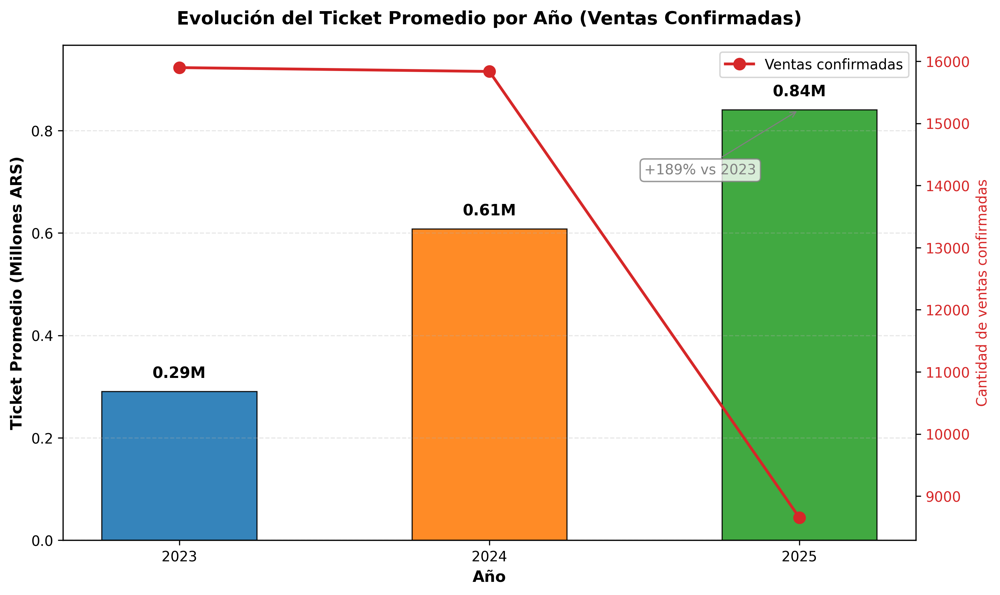
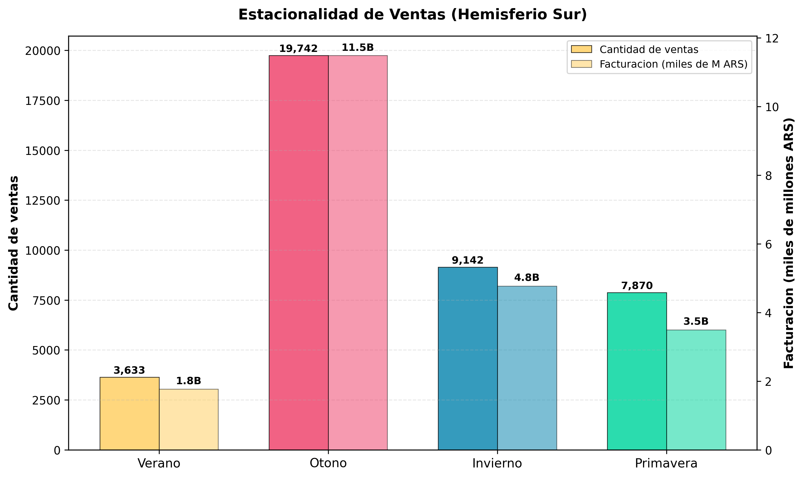

# Resultados y análisis del proyecto

Documento generado a partir de los resultados exportados de SQL Server (consultas básicas, avanzadas y prueba de índices). Período analizado: **2023–2025**.

---

## Resumen ejecutivo

| Indicador | Valor |
| --- | --- |
| Ventas totales registradas | 42.500 (2023–2025) |
| Ventas confirmadas | ~95 % del total anual |
| Unidades promedio por venta | 75 (mín. 2, máx. 359) |
| Ticket promedio 2023 | $290.474 ARS |
| Ticket promedio 2025 (parcial) | $840.813 ARS |
| Clientes en Top 10 | 100 % supermercados |
| Margen global por segmento | 59,9 % – 63,9 % |
| Mejora con índice (lecturas lógicas) | 1.078 → 662 (−38 %) |

### Hallazgos principales

1. **El negocio escala en valor por operación, no solo en cantidad de ventas.**

| Año | Ventas confirmadas | Ticket promedio (ARS) |
| --- | --- | --- |
| 2023 | 15.898 | 290.474 |
| 2024 | 15.836 | 607.906 |
| 2025 (parcial) | 8.653 | 840.813 |

2. **La estacionalidad es fuerte: otoño concentra la mayor actividad (hemisferio sur).**

| Estación | Cantidad de ventas | Facturación total (ARS) |
| --- | --- | --- |
| Otoño | 19.742 | 11.484.125.484 |
| Invierno | 9.142 | 4.771.616.275 |
| Primavera | 7.870 | 3.496.347.740 |
| Verano | 3.633 | 1.768.221.516 |

3. **El Top 10 de clientes es homogéneo: todos supermercados con ~$140 M de facturación.**

| Ranking | Cliente | Facturación (ARS) | Ganancia (ARS) | Margen (%) |
| --- | --- | --- | --- | --- |
| 1 | Supermercado 0098 | 144.220.638 | 90.750.992 | 62,9 |
| 2 | Supermercado 0048 | 143.604.356 | 90.827.824 | 63,2 |
| 3 | Supermercado 0088 | 142.610.976 | 89.417.400 | 62,7 |
| 4 | Supermercado 0027 | 141.356.365 | 88.708.027 | 62,8 |
| 5 | Supermercado 0015 | 141.351.315 | 89.388.351 | 63,2 |

4. **Lo más vendido no coincide con lo más rentable.**

| Ranking por unidades | Producto | Unidades | Ganancia (ARS) |
| --- | --- | --- | --- |
| 1 | Filet de Merluza 1kg | 244.483 | 1.327.251.674 |
| 2 | Morcilla 1kg | 243.494 | 795.582.393 |
| 3 | Apio Congelado 500g | 243.157 | 355.810.142 |

| Ranking por ganancia | Producto | Unidades | Ganancia (ARS) |
| --- | --- | --- | --- |
| 1 | Camarones 500g | 243.043 | 1.903.544.170 |
| 2 | Filet de Merluza 1kg | 244.483 | 1.327.251.674 |
| 3 | Corvina 1kg | 240.406 | 1.317.886.827 |

5. **Tarjeta de crédito domina la facturación en todos los años.**

| Año | Forma de pago | Cantidad ventas | Facturación (ARS) |
| --- | --- | --- | --- |
| 2023 | Tarjeta Crédito | 14.938 | 4.334.062.609 |
| 2024 | Tarjeta Crédito | 14.885 | 9.018.867.035 |
| 2025 | Tarjeta Crédito | 8.133 | 6.822.467.450 |

6. **Calidad operativa estable: cancelaciones bajas y consistentes.**

| Año | Total ventas | Confirmadas | Canceladas | % Confirmadas |
| --- | --- | --- | --- | --- |
| 2023 | 16.666 | 15.898 | 768 | 95,39 |
| 2024 | 16.712 | 15.836 | 876 | 94,76 |
| 2025 | 9.122 | 8.653 | 469 | 94,86 |

---

## Consultas avanzadas destacadas

### Evolución mensual de ventas y ganancias

La facturación mensual crece de forma sostenida entre 2023 y 2025. Los picos se repiten en **marzo, abril y mayo**. Enero 2025 y agosto 2025 muestran valores atípicamente bajos (período parcial o corte de datos).

**Archivo:** `data/a1.evolucion_mensual_ventas_ganancias.csv`

### Rentabilidad por tipo de comercio

| Tipo de comercio | Facturación (ARS) | Ganancia (ARS) | Margen (%) |
| --- | --- | --- | --- |
| Restaurante | 2.969.492.572 | 1.897.416.472 | 63,90 |
| Rotisería | 2.711.373.306 | 1.728.193.235 | 63,74 |
| Supermercado | 11.368.095.561 | 7.141.027.671 | 62,82 |
| Almacén | 2.297.229.000 | 1.406.559.360 | 61,23 |
| Kiosco | 460.041.925 | 275.495.628 | 59,88 |

Supermercados concentran la mayor facturación absoluta; restaurantes el margen más alto.

**Archivo:** `data/a3.rentabilidad_promedio_tipo_comercio.csv`

### Segmentación de clientes por frecuencia de compra

De **425 clientes activos** analizados, la gran mayoría se clasifica como **Recurrente** (frecuencia ≥ 90 %). Varios clientes alcanzan el 100 % de frecuencia, lo que confirma una base B2B fidelizada.

**Archivo:** `data/a6.clasificar_clientes_segun_frecuencia_compra.csv`

### Productos: volumen vs rentabilidad

Los mariscos y pescados premium (Camarones, Corvina) lideran en ganancia; congelados y embutidos mueven volumen pero con menor impacto en rentabilidad total.

**Archivo:** `data/a4.productos_mas_vendidos_vs_mas_rentables.csv`

---

## Consultas básicas: muestra representativa

Las 7 consultas básicas cubren validación del modelo mayorista, calidad operativa, medios de pago, antigüedad de clientes, ticket, estacionalidad y días pico.

### Unidades por venta (validación mayorista)

| Promedio | Mínimo | Máximo |
| --- | --- | --- |
| 75 | 2 | 359 |

Confirma operaciones de volumen, no venta minorista.

### Ticket promedio anual

Crecimiento de **+189 %** entre 2023 y 2025 en ticket promedio.

### Estacionalidad

El **día 10** del mes concentra el mayor volumen histórico (1.379 ventas, $751 M ARS), seguido por los días 1 y 2.

**Archivo:** `data/b7.dias_mes_mayor_volumen_ventas.csv`

### Antigüedad de clientes

| Rango de antigüedad | Cantidad de clientes |
| --- | --- |
| 0 a 2 años | 0 |
| 3 a 5 años | 390 |
| 6 a 8 años | 180 |
| 9 a 11 años | 0 |
| 12 años o más | 0 |

La base activa se concentra en clientes con **3 a 8 años** de relación comercial.

---

## Optimización con índices

Prueba sobre la consulta de evolución mensual (`05_Indices_y_Performance.sql`):

| Métrica | Sin índice | Con índice | Variación |
| --- | --- | --- | --- |
| Lecturas lógicas (Detalle_Ventas) | 1.078 | 662 | −38 % |
| Tiempo de ejecución | 360 ms | 302 ms | −16 % |
| Plan de ejecución | Clustered Index Scan | Index Scan (NonClustered) | — |

Capturas comparativas en `img/4.índices/`.

---

## Conclusiones

- El modelo mayorista está validado: alto volumen por operación y ticket creciente.
- Otoño (mar–may) es la ventana crítica para planificación comercial y logística.
- La cartera es estable, recurrente y concentrada en supermercados de facturación similar.
- Mariscos y pescados premium aportan más rentabilidad que productos de alto volumen.
- Tarjeta de crédito concentra más del 90 % de la facturación: riesgo operativo concentrado.
- Los índices en columnas de JOIN mejoran el rendimiento de consultas analíticas.

## Recomendaciones

1. Reforzar inventario y fuerza comercial en **otoño (mar–may)**.
2. Potenciar **mariscos y pescados premium** en la estrategia de márgenes.
3. Diseñar programas de fidelización para el **Top 10 de supermercados**.
4. Negociar condiciones con procesadores de **tarjeta de crédito** dado su peso en ingresos.
5. Mantener índices en `ID_Venta`, `ID_Cliente` y `Fecha_Venta` en producción.

---

## Gráficos disponibles

| Archivo | Descripción |
| --- | --- |
| `img/graficos/01_evolucion_mensual_ventas_ganancias.png` | Tendencia mensual 2023–2025 |
| `img/graficos/02_top10_clientes_facturacion.png` | Ranking de clientes |
| `img/graficos/03_productos_vendidos_vs_rentables.png` | Volumen vs rentabilidad |
| `img/graficos/04_rentabilidad_tipo_comercio.png` | Margen por segmento |
| `img/graficos/05_ticket_promedio_anual.png` | Ticket promedio anual |
| `img/graficos/06_estacionalidad_ventas.png` | Ventas por estación |

Generación: `python/generar_todos_graficos.py`
